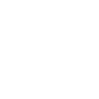

# 💫 About Me:
 I'm currently working on RedXGameLibrary I’m currently working on RedXGameLibrary 💻 I’m currently learning Rust

## 🌐 Socials:
   

# 💻 Tech Stack:
                                  
# 📊 GitHub Stats:
 
 

---

  ## 💰 You can help me by Donating
    

  
<picture>
  <source media="(prefers-color-scheme: dark)" srcset="https://raw.githubusercontent.com/FuryLemons/FuryLemons/output/github-contribution-grid-snake-dark.svg">
  <source media="(prefers-color-scheme: light)" srcset="https://raw.githubusercontent.com/FuryLemons/FuryLemons/output/github-contribution-grid-snake.svg">
  
</picture>
